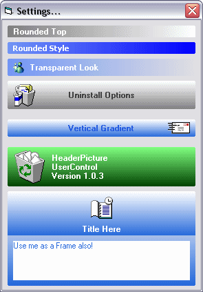



## Header UserControl III

### Description

6 Alignment, Picture Support & Multiline Properties Added. Check out the ScreenShot! Properties Include: Alignment/ Caption/ Font/ FontSize/ FontColor/ Gradient(Vert/Horiz)/ GradientStart Color/ GradientFinish Color/ GradientFinishStyle(Transparent/Opaque)/ MultiLine/ Picture/ Shape(Rounded/RoundedTop/Rectangle)
 
### More Info
 

             |
---                |---
**Submitted On**   |2004-04-17 17:02:02
**By**             |[Peter\.](https://github.com/Planet-Source-Code/PSCIndex/blob/master/ByAuthor/peter.md)
**Level**          |Intermediate
**User Rating**    |4.9 (84 globes from 17 users)
**Compatibility**  |VB 6\.0
**Category**       |[Custom Controls/ Forms/  Menus](https://github.com/Planet-Source-Code/PSCIndex/blob/master/ByCategory/custom-controls-forms-menus__1-4.md)
**World**          |[Visual Basic](https://github.com/Planet-Source-Code/PSCIndex/blob/master/ByWorld/visual-basic.md)
**Archive File**   |[Header\_Use1736374222004\.zip](https://github.com/Planet-Source-Code/peter-header-usercontrol-iii__1-53320/archive/master.zip)

